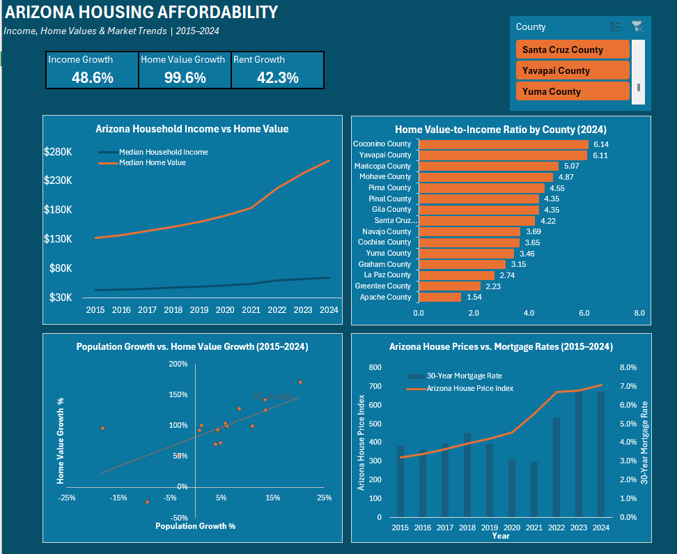

# Arizona Housing Affordability Analysis

## Project Overview

This project analyzes housing affordability trends in Arizona from 2015–2024 using data from the Federal Reserve Economic Data (FRED) system and the U.S. Census Bureau.

The analysis compares changes in home values, household income, rent, mortgage rates, and county-level housing conditions to better understand how affordability has changed across Arizona.

## Questions Explored

- How have Arizona home values changed from 2015–2024?
- How has household income changed during the same period?
- Have home values grown faster than income?
- How have rents changed?
- How do housing conditions differ across Arizona counties?
- What relationship exists between mortgage rates and Arizona home values?
- What major trends or unusual changes appear in the data?

## Tools Used

- Python
- Excel
- Power Query
- PivotTables
- FRED API
- U.S. Census Bureau / ACS Data

## Dashboard Preview

## Files

- `Arizona_Housing_Affordability_Dashboard.xlsx` — final Excel dashboard and analysis
- `dashboard_screenshot.png` — dashboard preview
- `Arizona_Housing_Affordability.ipynb` — analysis notebook *(coming next)*

## Data Sources

- Federal Reserve Economic Data (FRED)
- U.S. Census Bureau American Community Survey (ACS)

## Project Status

Dashboard complete. Jupyter Notebook analysis and documentation in progress.
